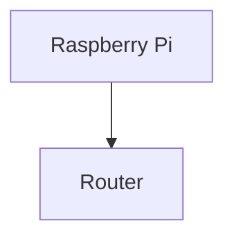
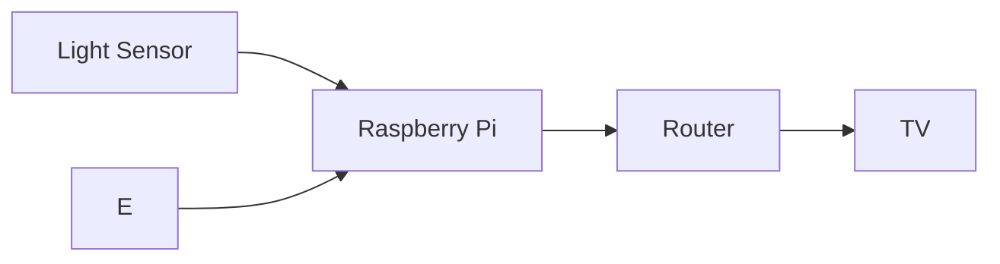

# practice

## Name
KXY

*KXY*

**KXY**

***KXY***

## School
There are two options to insert code

## Code Block
```
I am at NYP
Block S
Room 540
```

### Code Line
`sudo raspi-config`

## Adding Image

This is a nice image of a hamster


## Block Diagram
Top to Down


Left to Right
